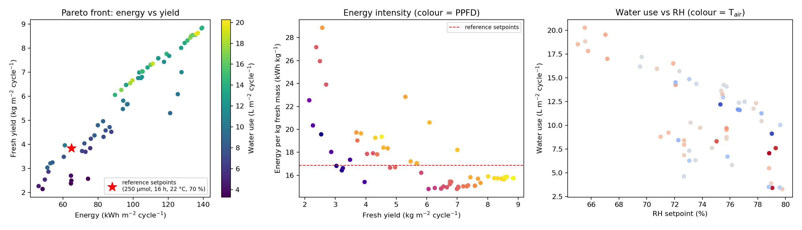
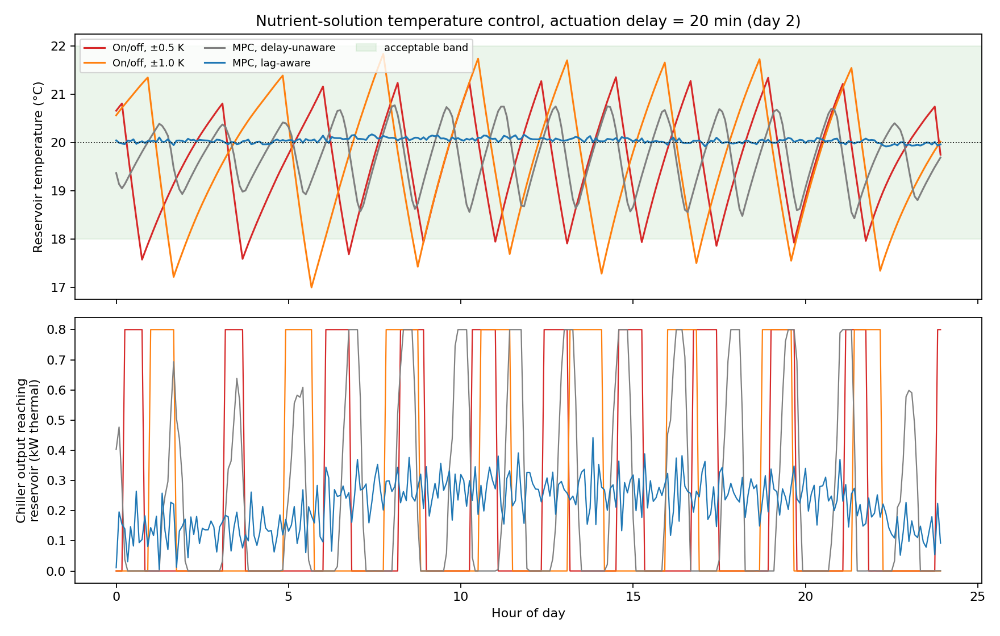
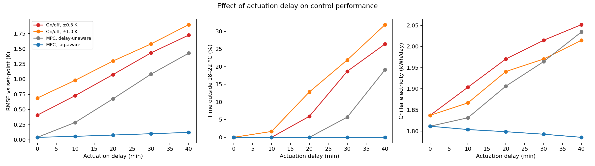

# Hydroponic CEA prototype: physics-based model → multi-objective optimization → lag-aware MPC

*Author: Wessam El-Ssawy*

A small, fully reproducible Python prototype for controlled-environment (indoor hydroponic lettuce) energy,
water and climate control. It has two parts that mirror two research directions:

1. **Facility-level operation (NSGA-II, `pymoo`)** – Pareto trade-offs among energy, water use and yield.
2. **Root-zone control (MPC, `CasADi`)** – nutrient-solution temperature control with an actuation delay,
   benchmarked against on/off thermostats and a delay-unaware MPC.

> **Status: illustrative prototype.** Parameters are plausible order-of-magnitude values, **not calibrated or
> validated** against a specific facility. The value of this repo is the workflow and the controller/optimizer
> structure, which can be re-parameterized with measured data.

**Pre-computed outputs** (figures and CSV files from one run) are in the repository root. Running the scripts regenerates them into `figures/` and `results/` folders.

## Run
```bash
pip install -r requirements.txt
python run_all.py          # runs everything below in one go
python cea_model.py        # one-cycle sanity check
python run_pareto.py       # NSGA-II -> results/pareto_front.csv, figures/pareto_front.png
python run_mpc.py          # MPC benchmark + delay sweep -> results/, figures/
```

## 1. Model (`cea_model.py`)
Per m² of floor, 28-day lettuce cycle at daily resolution:
- VPD-driven canopy transpiration (∝ LAI × VPD) → **latent load**; lighting + envelope → **sensible load**
- HVAC electricity from loads and a temperature-dependent COP; LED electricity from PPFD and efficacy
- Light-use-efficiency growth model with diminishing returns at high PPFD, temperature / VPD / photoperiod stress
- Outputs: energy (kWh m⁻²), water (L m⁻²), fresh yield (kg m⁻²)

## 2. Multi-objective optimization (`run_pareto.py`)
Decision variables: PPFD (150–450 µmol m⁻² s⁻¹), photoperiod (12–20 h), air-temperature set-point (18–26 °C),
RH set-point (55–80 %). Objectives: minimize energy, minimize water, maximize yield (NSGA-II, 80 individuals,
100 generations, seed 1). Non-viable corners of the raw front (yield < 2 kg m⁻² cycle⁻¹) are filtered out.

Result (this model): the front spans ≈46–139 kWh m⁻² and ≈2–9 kg m⁻². The most energy-efficient solutions reach
≈14.8 kWh kg⁻¹ (long photoperiod ≈20 h, moderate PPFD ≈280, T ≈22.5 °C, RH ≈72 %) versus ≈16.9 kWh kg⁻¹ for a
conventional reference set-point (250 µmol, 16 h, 22 °C, 70 %). See the figure below.

## 3. Lag-aware MPC (`run_mpc.py`)
Plant: 100 L reservoir, chiller acting through a transport/response **delay**, pump heat gain, room-air temperature
disturbance with lights-on/off cycle and AR(1) noise, sensor noise. MPC model has 20 % error in the reservoir–air
conductance and uses the *nominal* air-temperature forecast (no noise). The lag-aware MPC treats already-issued
commands as known pending inputs (state augmentation); the delay-unaware MPC assumes zero delay.
Controllers: on/off (±0.5 K, ±1.0 K), MPC delay-unaware, MPC lag-aware. Horizon 2 h, step 5 min, 3 simulated days.

Base case (20-min delay), set-point 20 °C, band 18–22 °C:

| Controller | RMSE (K) | Time outside band (%) | Chiller electricity (kWh/day) | Compressor starts/day |
|---|---|---|---|---|
| On/off ±0.5 K | 1.08 | 6.0 | 1.97 | 10.3 |
| On/off ±1.0 K | 1.30 | 12.9 | 1.94 | 8.0 |
| MPC, delay-unaware | 0.68 | 0.0 | 1.91 | 14.7 |
| MPC, lag-aware | 0.08 | 0.0 | 1.80 | 5.7 |

Delay sweep (0–40 min): RMSE of the lag-aware MPC grows only from 0.04 to 0.12 K, whereas on/off ±0.5 K goes from
0.41 to 1.73 K and the delay-unaware MPC from 0.04 to 1.43 K. See the figures below.

### Figures
**Pareto front (energy, water, yield)**



**Nutrient-solution temperature control, 20-min actuation delay (day 2)**



**Effect of actuation delay on control performance**



## Limitations (please read)
- Simulation only; no experimental validation. Parameters are illustrative.
- The MPC has a modulating actuator, whereas the on/off thermostats drive the chiller at full capacity; part of the
  advantage comes from this actuator authority, not only from prediction.
- The MPC knows the delay exactly and receives a good disturbance forecast. Delay mis-identification and forecast
  errors would reduce its advantage; testing this is a next step.
- Growth/transpiration sub-models are simple; Pareto results are only as good as those sub-models.

## Next steps
Calibrate transpiration and thermal balances with measured data (e.g., time-lapse canopy cover and water use);
online delay estimation; couple the MPC with the facility model (digital-twin); compare against an RL agent;
IoT data acquisition for the root zone (EC, pH, solution temperature, DO).
